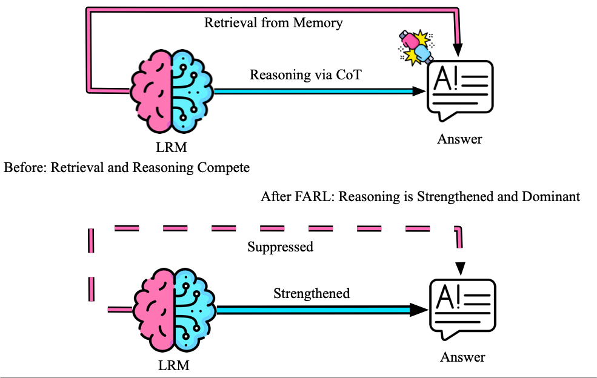

0.4.1.dev0


# Reasoning or Retrieval? A Study of Answer Attribution on Large Reasoning Models

This is the offical implemation of "Reasoning or Retrieval? A Study of Answer Attribution on Large Reasoning Models".
<!--  -->


## 🛠️ Setup

### Environment Setup
Create a virtual environment using Conda and intall packages:
```bash
conda create -n farl python=3.10.16
conda activate farl
pip install -r requirements.txt
conda deactivate
```

We suggest to create another environment for verl:
```bash
conda create -n verl python==3.10
conda activate verl
git clone --depth 1 --branch v0.4.1 https://github.com/volcengine/verl.git
cd verl
pip install --no-deps -e .
USE_MEGATRON=0 bash scripts/install_vllm_sglang_mcore.sh
cd ..
conda deactivate
```

### API Configuration

#### OpenAI
Set your OpenAI API key in the environment:
```bash
export OPENAI_API_KEY=<your_api_key>
```

#### Huggingface
1. Request access to [DeepSeek-r1](https://huggingface.co/collections/deepseek-ai/deepseek-r1-678e1e131c0169c0bc89728d) [Qwen3](https://huggingface.co/collections/Qwen/qwen3-67dd247413f0e2e4f653967f) [Phi4](https://huggingface.co/microsoft/Phi-4-mini-reasoning)
2. Set your Huggingface API token:
```bash
export HUGGINGFACE_API_TOKEN=<your_api_key>
```

#### Weights & Biases
Set up Weights & Biases for experiment tracking:
```bash
export WANDB_API_KEY=<your_api_key>
wandb login
```

## 📊 Experiment

### Pertubation Experiment
run reasoning level pertubation
```bash
bash script/reason_perturb.sh
```
run retrieval level pertubation
```bash
bash script/retrieval_perturb.sh
```
run combined pertubation, set "--cot_memory_perturb_same" to True or False for the same/disjoint target answers
```bash
bash script/combined_perturb.sh
```

### SFT
Train the model use SFT:
```bash
bash train/sft_correct.py
```

### GRPO
1. Prepare training data:
```bash
bash script/mmlu_verl_format.sh
```
2. Train the model use GRPO:
```bash
bash script/run_grpo.sh
```

### RARL
1. Add the following loss function into 'verl/verl/trainer/ppo/core_algos.py':
```python
from typing import Tuple
import torch
import torch.nn.functional as F
@register_policy_loss("npo_logistic_gate")
def compute_policy_loss_npo_gate(
    old_log_prob: torch.Tensor,               # (bs, L) ref or old policy log-prob; detached baseline
    log_prob: torch.Tensor,                   # (bs, L) current model log-prob; has grad
    advantages: torch.Tensor,                 # (bs, L)
    response_mask: torch.Tensor,              # (bs, L)
    loss_agg_mode: str,
    config,
) -> Tuple[torch.Tensor, torch.Tensor, torch.Tensor, torch.Tensor]:
    """
    Gate by advantages:
      - If advantages are (per-sample) uniform negative over response tokens (NPO step),
        apply logistic negative-RL loss:
           L_t = -log(sigmoid(old_log_prob_t - log_prob_t))
        weighted by |adv|.
      - Else, use vanilla PPO loss (GRPO step remains untouched).
    Returns the tuple expected by verl’s actor: (pg_loss, clipfrac, ppo_kl, clipfrac_lower).
    """
    mask = response_mask.bool()

    # Detect NPO step: per-sample std ~ 0 and mean < 0 over response tokens
    if mask.any():
        per_sample_var = torch.var(advantages * response_mask, dim=-1, unbiased=False)
        per_sample_std = torch.nan_to_num(torch.sqrt(per_sample_var))
        looks_uniform = torch.all(per_sample_std < 1e-6)
        mean_neg = (advantages[mask].mean() < 0)
    else:
        looks_uniform, mean_neg = False, False

    if looks_uniform and mean_neg:
        # NPO logistic loss: -log(sigmoid(ref - cur)) = -log(sigmoid(old - log_prob))
        per_token = -F.logsigmoid(old_log_prob - log_prob)  # grad only through log_prob
        # Make positive weights from negative advantages and aggregate like PPO
        weight = (-advantages).clamp_min(0.0)
        weighted = per_token * weight
        pg_loss = agg_loss(weighted, response_mask, loss_agg_mode)
        zero = torch.zeros_like(pg_loss)
        return pg_loss, zero, zero, zero

    # Fallback to vanilla PPO for GRPO
    return compute_policy_loss(
        old_log_prob=old_log_prob,
        log_prob=log_prob,
        advantages=advantages,
        response_mask=response_mask,
        cliprange=config.clip_ratio,
        cliprange_low=config.clip_ratio_low if config.clip_ratio_low is not None else config.clip_ratio,
        cliprange_high=config.clip_ratio_high if config.clip_ratio_high is not None else config.clip_ratio,
        clip_ratio_c=config.get("clip_ratio_c", 3.0),
        loss_agg_mode=loss_agg_mode,
    )
```
2. Train the model use FARL:
```bash
bash script/run_farl.sh
```

### Model Evaluation
1. Convert the verl ckpt into huggingface model:
```bash
bash script/ckpt_to_huggingface.sh
```
2. Add the model path into evaluation script and run it:
```bash
bash script/cot_acc.sh
```